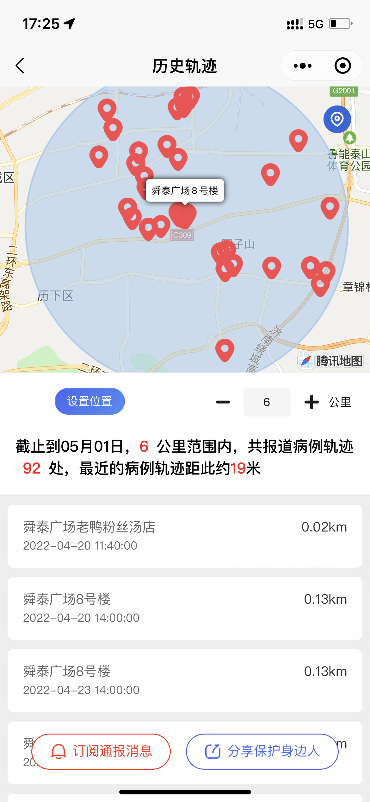
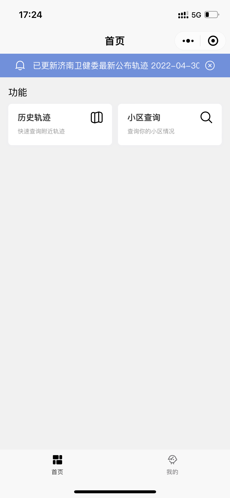
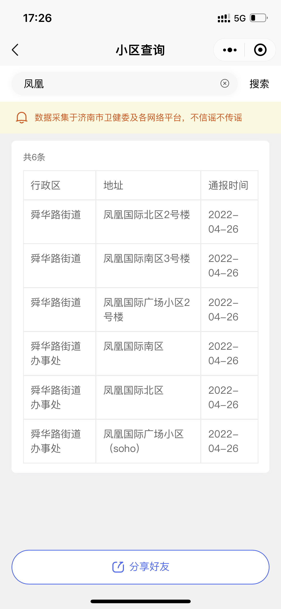
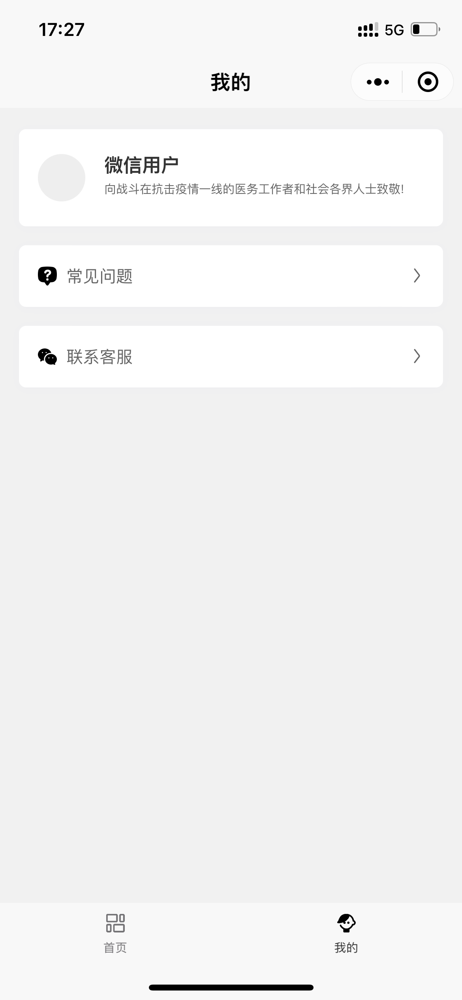
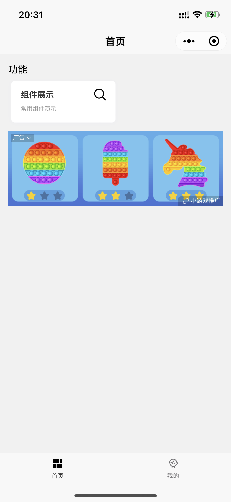
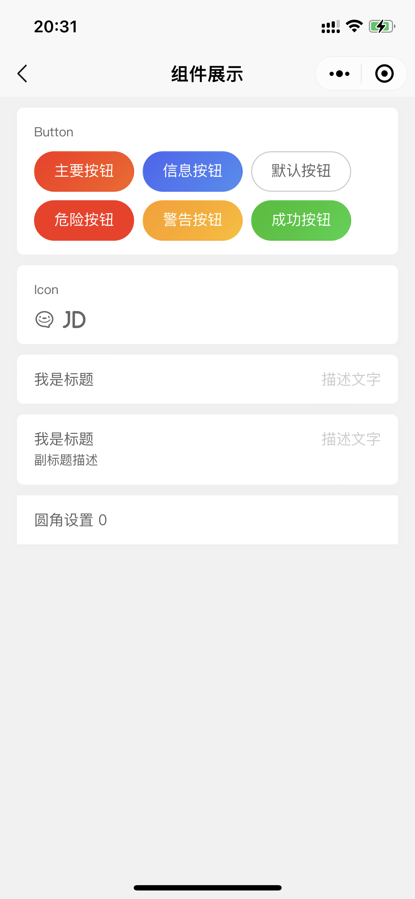

<div align="center">
  <h1>Trajectory</h1>
  <p>附近确诊出行轨迹小程序, Taro + Nutui + 微信云开发</p>
</div>

` ps: 最近疫情严重，被封在家。卫健委公布的轨迹信息看起来太抽象，闲着也没事用小程序展示轨迹信息 `

## 目录

- [目录](#目录)
- [过审 (有认证资质可以忽略)](#过审-有认证资质可以忽略)
- [功能](#功能)
- [微信云数据库记录结构](#微信云数据库记录结构)
- [微信小程序预览](#微信小程序预览)
- [展示](#展示)
- [审核版本展示](#审核版本展示)
- [License](#license)

## 过审 (有认证资质可以忽略)

<p>关于个人过审的问题, 小程序审核就是脑抽</p>
<p>过程真是很蛋疼，第一次提交审核全功能给我过审。版本更新卡我个人资质不能使用出行和交通插件:smile:</p>
<p>我特么都提交审核好几次了，之前怎么不卡这玩意:weary:</p>

> 解决： 
> 
> .env配置文件中的版本号要高于数据库中的version， 线上环境根据版本号匹配，判断是否是审核版本。
> 
> 审核版本隐藏掉所有页面，并显示功能移除文案。 只做组件Demo演示
[审核版本展示](#审核版本展示)

## 功能

1. 历史轨迹地图
2. 封控、管控小区查询
3. 小程序广告

> 数据源自行采集各地卫健委发布的轨迹信息

## 微信云数据库记录结构

`集合自行创建`

> community：封控、管控

```
  {
    address: string; // 地址
    area: string; // 行政区划
    date: date; // 日期
    type: string; // 类型
  }
```

> config： 配置

```
  {
    name: string; // 配置项
    value: any; // 配置值
  }
```

> trajectory：轨迹

```
  {
    address: string; // 地址
    detail: string; // 详情
    date: date; // 日期
    location: geopoint; // 坐标
  }
```

> user：用户

```
  // 微信用户信息
```


## 微信小程序预览

附近确诊轨迹（济南确诊轨迹，封控、管控小区查询） 

<a href="https://raw.githubusercontent.com/eamesh/trajectory/dev/resource/qrcode.jpg"></a>

## 展示

<a href="https://raw.githubusercontent.com/eamesh/trajectory/dev/resource/01.png"></a>
<a href="https://raw.githubusercontent.com/eamesh/trajectory/dev/resource/02.png"></a>
<a href="https://raw.githubusercontent.com/eamesh/trajectory/dev/resource/03.png"></a>
<a href="https://raw.githubusercontent.com/eamesh/trajectory/dev/resource/04.png"></a>

## 审核版本展示
<a href="https://raw.githubusercontent.com/eamesh/trajectory/dev/resource/05.png"></a>
<a href="https://raw.githubusercontent.com/eamesh/trajectory/dev/resource/06.png"></a>


> 开源项目，请勿用于违法活动。任何相关法律问题与本人无关

## License

MIT License

Copyright (c) 2022 太年轻

Permission is hereby granted, free of charge, to any person obtaining a copy
of this software and associated documentation files (the "Software"), to deal
in the Software without restriction, including without limitation the rights
to use, copy, modify, merge, publish, distribute, sublicense, and/or sell
copies of the Software, and to permit persons to whom the Software is
furnished to do so, subject to the following conditions:

The above copyright notice and this permission notice shall be included in all
copies or substantial portions of the Software.

THE SOFTWARE IS PROVIDED "AS IS", WITHOUT WARRANTY OF ANY KIND, EXPRESS OR
IMPLIED, INCLUDING BUT NOT LIMITED TO THE WARRANTIES OF MERCHANTABILITY,
FITNESS FOR A PARTICULAR PURPOSE AND NONINFRINGEMENT. IN NO EVENT SHALL THE
AUTHORS OR COPYRIGHT HOLDERS BE LIABLE FOR ANY CLAIM, DAMAGES OR OTHER
LIABILITY, WHETHER IN AN ACTION OF CONTRACT, TORT OR OTHERWISE, ARISING FROM,
OUT OF OR IN CONNECTION WITH THE SOFTWARE OR THE USE OR OTHER DEALINGS IN THE
SOFTWARE.
